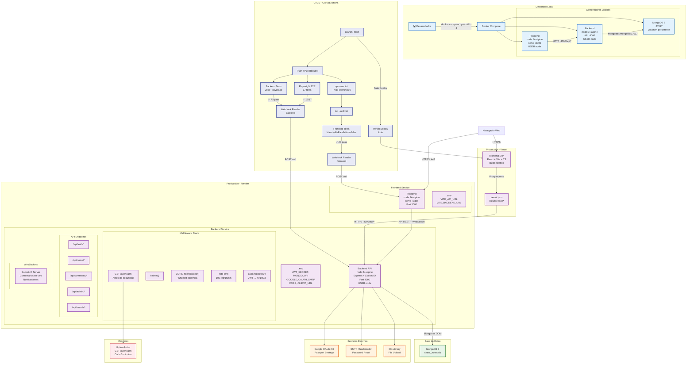

# Diagrama de Despliegue — Share Notes

## Flujo de Petición (Request Lifecycle)

1. **Cliente** → Navegador carga SPA desde Vercel o Render
2. **Frontend** → Axios hace petición HTTPS al Backend en Render
3. **Middleware Stack** → `GET /api/health` → Helmet → CORS (`.filter(Boolean)`) → RateLimit → Router
4. **Autenticación** → `auth.middleware` verifica JWT → 401 si no hay token → 403 si no hay permisos
5. **Controlador** → Ejecuta lógica de negocio → Mongoose consulta MongoDB
6. **Respuesta** → JSON viaja al Frontend → React actualiza UI
7. **Tiempo Real** → Socket.IO emite eventos (comentarios, notificaciones)

## CI/CD Pipeline Flow

1. `git push main` → GitHub Actions dispara workflow
2. **Jobs paralelos**: Backend (lint + test), Frontend (typecheck + lint + test), E2E
3. **Si todo pasa**: Webhook POST a Render → Deploy automático + Vercel auto-deploy
4. **Monitoreo**: UptimeRobot ping a `/api/health` cada 5 minutos
