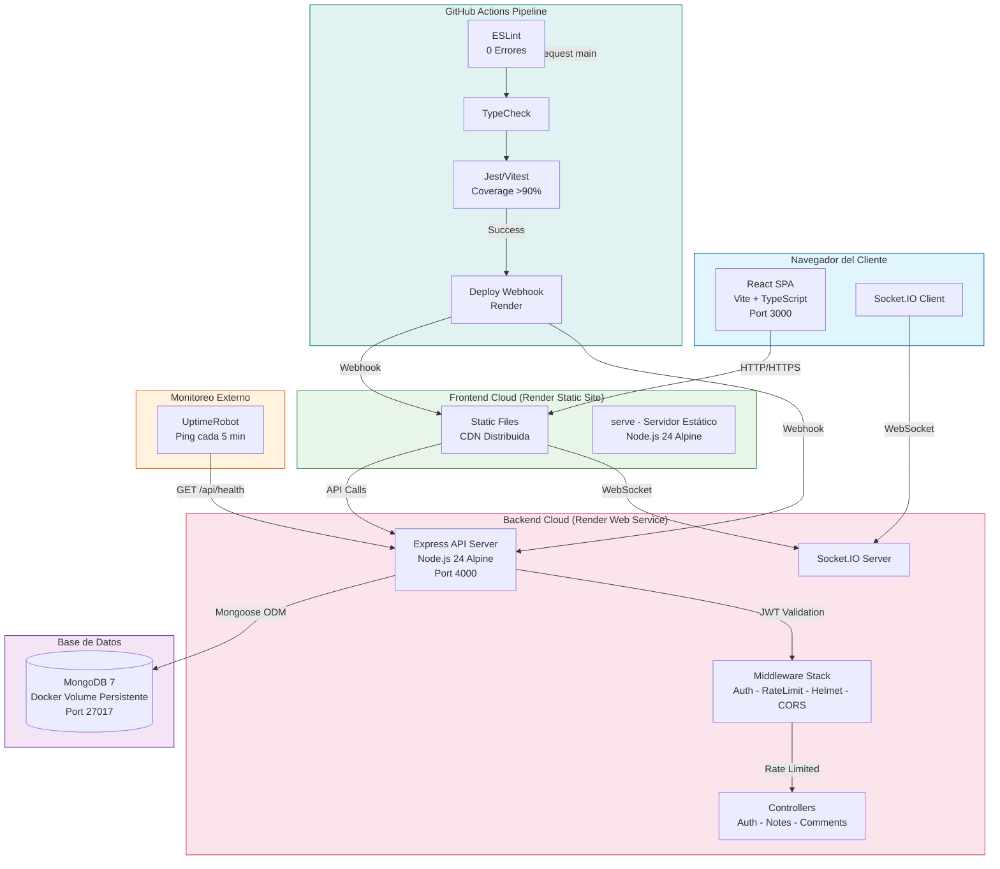

# Diagrama de Despliegue - SHARE-NOTAS

## Arquitectura de Red Full-Stack

## Flujo de Red

1. **Cliente → Frontend**: El navegador carga la SPA React desde el CDN de Render (puerto 3000)
2. **Frontend → Backend**: Las peticiones API se envían a `https://share-notes-api.onrender.com/api/*` (puerto 4000)
3. **WebSockets**: Conexión persistente bidireccional para eventos `note:shared` y `comment:new`
4. **Backend → MongoDB**: Persistencia de datos mediante Mongoose ODM en MongoDB 7
5. **Monitoreo**: UptimeRobot realiza pings a `GET /api/health` cada 5 minutos para mantener el servidor activo

## Componentes del Ecosistema

| Componente | Tecnología | Puerto | Contenedor |
|-----------|-----------|--------|------------|
| Frontend | React 18 + Vite + TypeScript | 3000 | share-notes-frontend |
| Backend | Node.js 24 + Express 4 | 4000 | share-notes-api |
| Base de Datos | MongoDB 7 | 27017 | share-notes-mongodb |
| Monitoreo | UptimeRobot | - | Externo |
| CI/CD | GitHub Actions | - | Automatizado |
