# Diagrama de Despliegue — Share Notes

```mermaid
graph TB
    subgraph "Internet"
        DNS[("DNS")]
        CDN[("CDN")]
    end

    subgraph "Cliente"
        Browser[Navegador Web<br/>Chrome/Edge/Firefox]
        subgraph "Frontend SPA"
            ReactApp["React + Vite<br/>TypeScript"]
            Axios["Axios HTTP Client"]
            SocketIOClient["Socket.IO Client"]
        end
    end

    subgraph "Producción - Render.com"
        subgraph "Frontend Container"
            FE["Frontend Service<br/>node:24-alpine<br/>Port 3000<br/>serve -s dist"]
            ENV_FE[".env<br/>VITE_API_URL"]
        end

        subgraph "Backend Container"
            BE["Backend Service<br/>node:24-alpine<br/>Port 5000"]
            ENV_BE[".env<br/>JWT_SECRET, MONGO_URI<br/>SMTP, GOOGLE_OAUTH<br/>CLIENT_URL, CORS_ORIGINS"]
            subgraph "API REST Endpoints"
                AUTH["/api/auth/*<br/>Register, Login, OAuth"]
                NOTES["/api/notes/*<br/>CRUD, Share, Rate"]
                COMMENTS["/api/comments/*<br/>CRUD"]
                CATEGORIES["/api/categories/*<br/>CRUD"]
                SEARCH["/api/search<br/>/api/stats<br/>/api/tags"]
                ADMIN["/api/admin/*<br/>Dashboard, Users"]
                HEALTH["/api/health<br/>UptimeRobot"]
                FILES["/api/files/*<br/>Upload/Download"]
            end
            subgraph "Real-Time"
                WS["Socket.IO Server<br/>Comments, Notifications"]
            end
            subgraph "Seguridad"
                HELMET["Helmet.js<br/>HTTP Security Headers"]
                RATELIMIT["express-rate-limit<br/>100 req/15min"]
                CORS["CORS Whitelist<br/>Origin Validation"]
            end
        end

        subgraph "MongoDB Atlas"
            MONGO["MongoDB 7.0 Cluster<br/>M10 (Replica Set)"]
            MONGO_ACL["Network Access<br/>IP Whitelist Render"]
        end
    end

    subgraph "Servicios Externos"
        GOOGLE["Google OAuth 2.0<br/>Passport Strategy"]
        SMTP["SMTP Mail Server<br/>Nodemailer<br/>Password Reset"]
        CLOUDINARY["Cloudinary<br/>Image Upload"]
    end

    subgraph "Monitoreo"
        UPTIME["UptimeRobot<br/>HTTP GET /api/health<br/>Every 5 minutes"]
        GITHUB["GitHub Actions<br/>CI/CD Pipeline"]
    end

    subgraph "Repositorio GitHub"
        MAIN["Branch: main"]
        WORKFLOW[".github/workflows/ci.yml"]
        WEBHOOK_FE["Render Deploy Hook<br/>Frontend"]
        WEBHOOK_BE["Render Deploy Hook<br/>Backend"]
    end

    Browser -->|"HTTPS :443"| FE
    Browser -->|"HTTPS :443"| BE

    ReactApp --> Axios
    ReactApp --> SocketIOClient
    Axios -->|"API REST JSON"| BE
    SocketIOClient -->|"WebSocket"| WS

    BE --> MONGO
    BE --> GOOGLE
    BE --> SMTP
    BE --> CLOUDINARY

    FE --> ENV_FE
    BE --> ENV_BE

    HEALTH --> UPTIME

    GITHUB -->|"git push main"| WORKFLOW
    WORKFLOW -->|"Lint + Test + Coverage"| MAIN
    WORKFLOW -->|"Webhook POST"| WEBHOOK_FE
    WORKFLOW -->|"Webhook POST"| WEBHOOK_BE
    WEBHOOK_FE -->|"Deploy"| FE
    WEBHOOK_BE -->|"Deploy"| BE

    classDef frontend fill:#e1f5fe,stroke:#0288d1,stroke-width:2px
    classDef backend fill:#f3e5f5,stroke:#7b1fa2,stroke-width:2px
    classDef database fill:#e8f5e9,stroke:#388e3c,stroke-width:2px
    classDef external fill:#fff3e0,stroke:#f57c00,stroke-width:2px
    classDef monitoring fill:#ffebee,stroke:#d32f2f,stroke-width:2px
    classDef ci fill:#e8eaf6,stroke:#3949ab,stroke-width:2px

    class FE,ReactApp,Axios,SocketIOClient,Browser frontend
    class BE,HEALTH,WS,HELMET,RATELIMIT,CORS,AUTH,NOTES,COMMENTS,CATEGORIES,SEARCH,ADMIN,FILES backend
    class MONGO,MONGO_ACL database
    class GOOGLE,SMTP,CLOUDINARY,CDN,DNS external
    class UPTIME monitoring
    class GITHUB,WORKFLOW,WEBHOOK_FE,WEBHOOK_BE,MAIN ci
```

## Flujo de Petición (Request Lifecycle)

1. **Cliente** → Navegador carga SPA desde Render (Frontend)
2. **Frontend** → Axios hace petición HTTPS al Backend
3. **Backend** → Helmet aplica headers de seguridad → CORS valida origen → RateLimit verifica throttling → Router dirige al controlador
4. **Controlador** → Auth middleware verifica JWT (cookie/Authorization header) → Ejecuta lógica de negocio
5. **Modelo** → Mongoose ODM consulta/guarda en MongoDB Atlas
6. **Respuesta** → JSON viaja de vuelta al Frontend → React actualiza UI
7. **Tiempo Real** → Socket.IO emite eventos a usuarios conectados (compartir nota, nuevo comentario)
